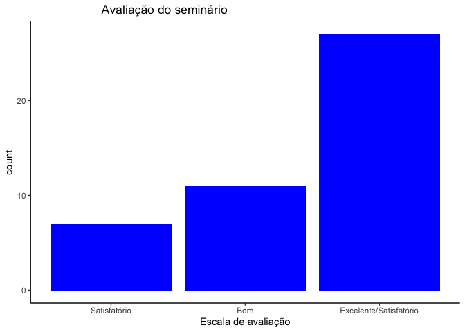
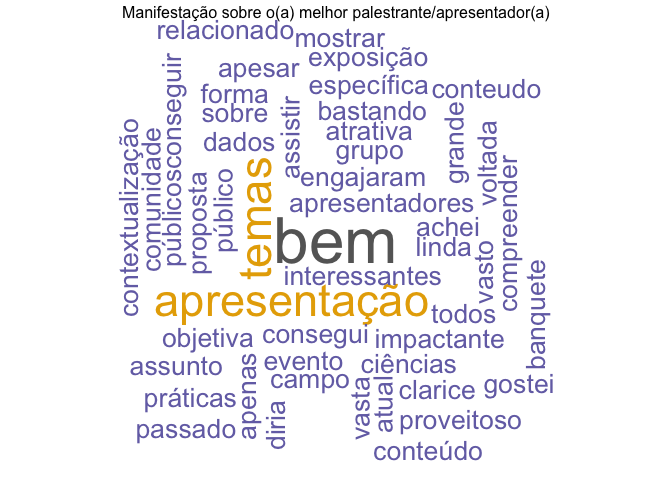
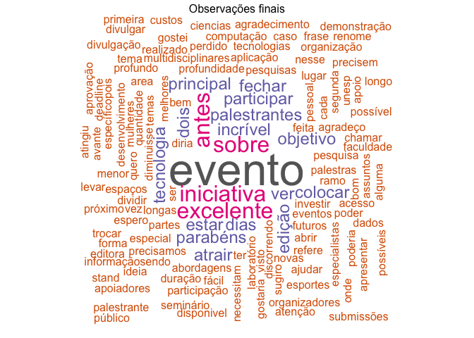

= Análise exploratória e descritiva inicial do I SINCID
João Pedro Albino; Grupo de Pesquisa LInDa

== Introdução

_Ciência de Dados_ é uma área interdisciplinar que envolve coleta, processamento, análise e interpretação de dados com o objetivo de extrair conhecimento e _insights_footnote:[Insight é a compreensão de uma causa e efeito específica dentro de um contexto particular. O termo insight pode ter vários significados relacionados. Uma otra definição de insight em português seria "`a capacidade de uma pessoa obter uma compreensão intuitiva precisa e profunda de alguma coisa`". A palavra insight também é frequentemente usada no mundo dos negócios, adquirindo o sentido de ideia que pode ser inovadora ou que pode ser a solução para determinado problema da empresa. Yasmin (s/d).] úteis que podem ser utilizados para tomada de decisõesfootnote:[A teoria da decisão (ou teoria da escolha) é um ramo da teoria da https://en.wikipedia.org/wiki/Probability_theory[probabilidade] aplicada e da https://en.wikipedia.org/wiki/Analytic_philosophy[filosofia analítica] preocupada com a tomada de decisões com base na atribuição de https://en.wikipedia.org/wiki/Probabilities[probabilidades] a vários fatores e na atribuição de https://en.wikipedia.org/wiki/Statistical_significance[consequências numéricas] ao resultado. Dictionary.com (2020).], realizar previsõesfootnote:[Os modelos de análise preditiva são projetados para avaliar dados históricos, descobrir padrões, observar tendências e usar essas informações para prever tendências futuras. Os modelos populares de análise preditiva incluem modelos de classificação, agrupamento e séries temporais. IBM (s/d).], otimizaçãofootnote:[Otimização é uma coleção de princípios matemáticos e métodos usados para resolver problemas quantitativos em muitas disciplinas, incluindo física, biologia, engenharia, economia e negócios. Britannica (s/d).] e muito mais.

Por representar uma concepção moderna, a ciência de dados se refere à integração e colaboração de diferentes disciplinas ou campos do conhecimento visando abordar questões complexas de maneira mais completa e integrada, ou seja, como um todo e não de maneira compartimentada.

E também por tratar-se de uma _disciplina_ - no sentido de converter-se em novo ramo do conhecimento, tipicamente estudado no ensino superior - recentemente estabelecida como tal, e um campo emergente de pesquisa interdisciplinar na sua origem, o Grupo de Pesquisa *LinDa* (Laboratório de Inteligência de Dados) idealizou e promoveu, o primeiro seminário em ciência de dados da região de Bauru, em outubro de 2023.

Composto por profissionais de diferentes áreas do conhecimento e também por alunos do _Programa de Pós-graduação em Mídia e Tecnologia_ (PPG-MiT), da Faculdade de Arquitetura, Artes, Comunicação e Design (FAAC) da Unesp - Campus de Bauru, o grupo de pesquisa LInDa tem como objetivo realizar pesquisas relacionadas à "`Ciência de Dados`", e em particular estudar estruturas de dados aonde seja possível extrair *inteligência*.

Neste contexto, *inteligência de dados* na nomenclatura do grupo de pesquisa, refere-se ao estudo e implementação de ferramentas e métodos analíticos para estabelecer uma melhor interpretação dos dados coletados transformados em informações para assim aprimorar sua análise e compreensão de forma a promover uma melhor tomada de decisão e permitir sua utilização em diferentes áreas do conhecimento.

O grupo de pesquisa LInDa tem como missão pesquisar, de forma multidisciplinar, tópicos relacionados à ciência baseada em dados, onde seja possível extrair conhecimento e propor soluções e algoritmos para trabalhar em temas transversais tais como: _big data_, _cidades inteligentes_, _internet das coisas_, gráficos de conhecimento, inteligência artificial, dentre outros, combinados em diferentes campos de trabalho em estatística e computação para que sejam melhor analisadas e interpretadas e possam contribuir para tomadas de decisões mais assertivas.

Portanto, este *I SINCID LINDA* - _I Seminário Interdisciplinar de Ciência de Dados LInDa_ - executado pelos componentes do grupo de pesquisa, foi realizado na modalidade híbridafootnote:[Um evento híbrido é uma exposição, conferência, desconferência (reunião conduzida pelos participantes que tentam evitar os aspectos hierárquicos de uma conferência convencional), seminário, workshop ou outra reunião que combina um evento presencial "`ao vivo`" com um componente on-line "`virtual`". Wikipedia contributors (2023).] e teve como principal desafio abordar _aplicações_, _desafios_ e _implicações_ na *análise* e no *uso* *dos dados* em diferentes contextos. O seminário visou incentivar a colaboração entre especialistas de diversas áreas e contribuir para uma compreensão mais profunda e multidimensional do campo da Ciência de Dados.

Tendo por base estes objetivos, este primeiro evento buscou também incentivar a colaboração e a troca de conhecimentos entre áreas distintas.

Realizado com o apoio do *PPG-MiT*, contou também com apoio financeiro e de logística da https://www.faac.unesp.br/#!/sobre-a-faac/administracao/diretoria/[Diretoria da Faculdade de Arquitetura&#44; Artes&#44; Comunicação e Design] da FAAC, recursos financeiros do link:++https://www.faac.unesp.br/#!/pos-graduacao/mestrado-e-doutorado/midia-e-tecnologia---doutorado/recursos-financeiros-do-proap/++[PROAP] - *Programa de Apoio à Pós-graduação -* da *Coordenação de Aperfeiçoamento de Pessoal de Nível Superior* - CAPES -, além do apoio e colaboração de diferentes patrocinadoresfootnote:[Patrocinadores e apoiadores relacionados no site do seminário em: https://eventos.faac.unesp.br/sincidlinda2023/[I SINCID LINDA].] o I SINCID LINDA buscou transcender as barreiras tradicionais das disciplinas individuais, tais como: _Engenharia_; _Ciências Humanas_ e _Tecnologia_; e foi idealizado para incentivar a colaboração e a troca de conhecimentos entre áreas distintas.

Contando com um conjunto interdisciplinar de palestrantes convidados, as apresentações realizadas no seminário explorou diferentes formas de aplicações, debateu os preementes desafios no mundo de hoje sobre o uso dos dados e procurou mostrar quais as implicações do emprego da ciência de dados em suas diversas áreas de atuação.

O seminário contou também com apresentação e discussão de trabalhos submetidos e aprovados nos três Grupos de Trabalho (GTs) além da apresentação e debates sobre os trabalhos desenvolvidos por integrantes atuais e egressos do grupo LInDa.

Visando avaliar o seminário, solicitou-se aos participantes que se inscreveram, e mesmo àqules que não puderam ou conseguiram se inscrever ou participar do evento, que opinassem sobre sua estrutura, organização e conteúdo, sugestões de melhorias além de solicitar também sugestões à respeito de temas ou tópicos visando aprimorar as próximas conferências. Para tanto, foi elaborado um questionário de pesquisa em Google Forms.

Nos próximos tópicos, será apresentada a Análise Exploratória de Dados (AED) referente aos dados coletados com o questionário.

A AED é procedimento aplicado em conjuntos de dados (ou "`datasets`") tabulados (dados dispostos em colunas e linhas), de modo a resumir suas características principais, frequentemente utilizando métodos visuais para facilitar sua percepção.

Para a análise exploratória e visualização de dados, foram utilizados a _linguagem R_ e o _ambiente integrado de desenvolvimento RStudio_.

Participaram dessa pesquisa 45 respondentes.

== Análise Exploratória de Dados - Fundamentação teórica

a linguagem R. A linguagem R é uma linguagem de programação bastante utilizada para análise e visualização de dados. Para criar gráficos em R, você pode utilizar o pacote ggplot2, que é um dos pacotes mais utilizados para esse fim.

== Resultados Obtidos

*Gênero* dos respondentes:

*Faixa etária* dos respondentes:

Dos respondentes do questionário, *quantas pessoas se inscreveram ou não no seminário*:

Opinião sobre *o seminário como um todo*:

O que você achou do *conteúdo das apresentações*

Avaliação sobre a *qualidade das apresentações*

Avaliação sobre a *organização do seminário*

Avaliação sobre o *formato do seminário*

Avaliação sobre o *duração do seminário*?

Avaliação se o *conteúdo do seminário atendeu as expectativas*

Descreva os *motivos do seminário ter atendido as expectativas*

....
[1] "Principais ocorrências do seminário ter atendido as expectativas"
....

....
[1] "evento = 3"
[1] "forma = 3"
....

Indicação do/da(s) *melhor(es) apresentadoras(es) ou palestrante(s)*

Discorrer sobre o/a(s) *melhor(es) apresentadoras(es) ou palestrante(s)*

....
[1] "Principais ocorrências o(a) melhor palestrante/apresentador(a)"
....

....
[1] "bem = 3"
[1] "temas = 2"
[1] "apresentação = 2"
....

Discorrer sobre o *gostou no seminário:*

....
[1] "Principais ocorrências sobre o que mais gostou no seminário"
....

....
[1] "temas = 5"
[1] "dados = 4"
[1] "conteúdo = 3"
[1] "sobre = 3"
[1] "assuntos = 2"
[1] "maneira = 2"
[1] "dinâmica = 2"
[1] "ciência = 2"
[1] "tema = 2"
[1] "objetivo = 2"
[1] "palestras = 2"
[1] "conhecer = 2"
[1] "grupo = 2"
[1] "pesquisas = 2"
[1] "linda = 2"
[1] "seminário = 2"
[1] "dia = 2"
....

Discorrer sobre do que *NÃO gostou no seminário:*

....
[1] "Principais ocorrências sobre o que não gostou no seminário"
....

....
[1] "algumas = 4"
[1] "online = 3"
[1] "tempo = 3"
[1] "acredito = 2"
[1] "evento = 2"
[1] "áudio = 2"
[1] "sobre = 2"
[1] "alguns = 2"
[1] "apresentação = 2"
[1] "ser = 2"
[1] "duração = 2"
[1] "pouco = 2"
....

Discorrer sobre *o que poderia ser melhorado no seminário:*

....
[1] "Principais ocorrênciaso que poderia ser melhorado no seminário"
....

....
[1] "dados = 4"
[1] "tempo = 4"
[1] "pouco = 3"
[1] "forma = 3"
[1] "ficou = 2"
[1] "online = 2"
[1] "participantes = 2"
[1] "transmissão = 2"
[1] "conteúdo = 2"
[1] "apresentações = 2"
[1] "melhor = 2"
[1] "slides = 2"
[1] "acho = 2"
[1] "corrido = 2"
[1] "objetivas = 2"
[1] "podem = 2"
[1] "ver = 2"
[1] "cada = 2"
....

Indicação sobre *qual a razão ou o motivo de não ter participado no seminário:*

Discorrer *sobre motivos de não participação no seminário:*

....
[1] "Principais motivos de não participação no seminário"
....

....
[1] "participar = 3"
[1] "acesso = 2"
[1] "evento = 2"
[1] "nao = 2"
[1] "artigo = 2"
....

Sugerir *sobre tópicos para os futuros seminários:*

....
[1] "Principais sugestõers de tópicos para os próximos seminários"
....

....
[1] "dados = 19"
[1] "ciência = 10"
[1] "artificial = 6"
[1] "inteligência = 6"
[1] "saúde = 4"
[1] "área = 4"
[1] "python = 3"
[1] "modelos = 3"
[1] "etl = 2"
[1] "aplicada = 2"
[1] "direito = 2"
[1] "educação = 2"
[1] "mercado = 2"
[1] "análise = 2"
[1] "diversas = 2"
[1] "interdisciplinaridade = 2"
[1] "prática = 2"
[1] "áreas = 2"
[1] "estatística = 2"
[1] "learning = 2"
....

Respostas sobre se *recomendaria o SINCID para outras pessoas*:

Motivos e/ou razões para *recomendar o SINCID para outras pessoas*:

....
[1] "Principais respostas sobre se recomendaria o seminário a outras pessoas"
....

....
[1] "dia = 2"
[1] "conhecimento = 2"
[1] "pessoas = 2"
[1] "pois = 2"
[1] "empresas = 2"
....

*Comentários e/ou Observações finais* sobre o I SINCID:

....
[1] "Principais observações finais"
....

....
[1] "evento = 7"
[1] "sobre = 3"
[1] "iniciativa = 3"
[1] "excelente = 3"
[1] "antes = 3"
[1] "incrível = 2"
[1] "palestrantes = 2"
[1] "ver = 2"
[1] "dias = 2"
[1] "dois = 2"
[1] "edição = 2"
[1] "parabéns = 2"
[1] "participar = 2"
[1] "estar = 2"
[1] "objetivo = 2"
[1] "tecnologia = 2"
[1] "atrair = 2"
[1] "colocar = 2"
[1] "fechar = 2"
[1] "principal = 2"
....

== Conclusões preliminares

== Referências

Decision theory Definition and meaning. Dictionary.com, 27 abr. 2020. Disponível em: https://www.dictionary.com/browse/decision-theory. Acesso em: 04 dez. 2023.

Optimization. Britannica. Disponível em: https://www.britannica.com/science/optimization/The-simplex-method. Acesso em: 04 dez. 2023.

Qual a tradução de insight? O que significa?. Definicao.net. Disponível em: https://definicao.net/insight/. Acesso em: 04 dez. 2023.

What is predictive analytics?. IBM. Disponível em: https://www.ibm.com/topics/predictive-analytics. Acesso em: 04 dez. 2023.

Hybrid event. Wikipedia contributors. Wikipedia, The Free Encyclopedia, 7 out. 2023. Acesso em: 4 dez. 2023.
